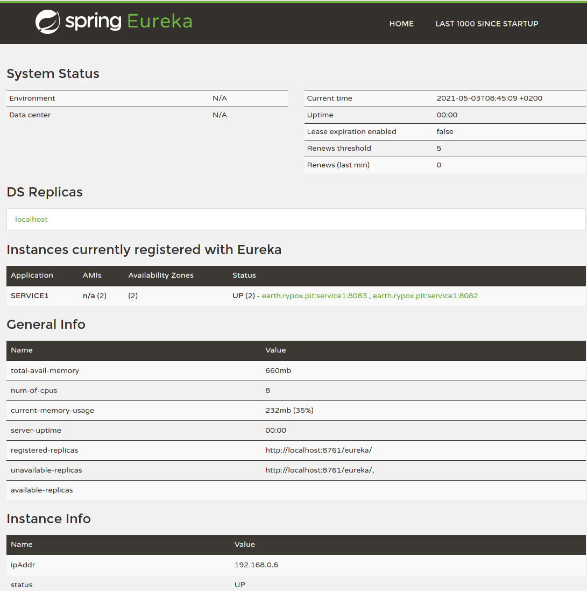

# Spring Cloud Services
Official documentation [Service Registration and Discovery](https://spring.io/guides/gs/service-registration-and-discovery/)
## In diesem Proof of Concept (POC) soll:

 1. mit Eureka ein Registry angelegt werden.
 2. mind. zwei Services (Spring Boot) erzeugt werden, die sich in Eureka registrieren und den gleichen Namen besitzen.
 3. ein Client angelegt werden, der die Services über die Registry anfragt. Und die Services an Hand der Informationen, die von der Eureka Registry geliefert werden aufruft.

### Artikel zum Thema Service Registry
- [Spring Boot + Netflix Eureka For Service Discovery In Microservices](https://m.heise.de/developer/artikel/Eureka-Microservice-Registry-mit-Spring-Cloud-2848238.html?seite=all)
- [Eureka – Microservice-Registry mit Spring Cloud](https://medium.com/techno101/spring-boot-netflix-eureka-for-service-discovery-in-microservices-cc81cca96144)

## How to run:
 1. to start Eureka: 
Go to the folder [poc-registration-discovery](https://github.com/obeidi/poc-registration-discovery)/[server](https://github.com/obeidi/poc-registration-discovery/tree/master/server)/ and enter:
**mvn spring-boot:run** 
View Eureka in your browser.:
http://localhost:8761/

 2. to start the two service that registry in Eureka:
go to the folder [/service1](service1) or [/service2](service2) and enter: **mvn spring-boot:run**

3. last but not least, start the Client: [poc-registration-discovery](https://github.com/obeidi/poc-registration-discovery)/[InquirerClient](https://github.com/obeidi/poc-registration-discovery/tree/master/InquirerClient): **mvn spring-boot:run**
after the client has started, a request can now be made in Eureka via browser.
http://localhost:8090/client/service-instances/service1-8081 or 
http://localhost:8090/client/service-instances/service2-8082

## Grafische Darstellung: 

## OpenApi Dokumentation
- OpenAPI 3 & Spring Boot reference docs https://springdoc.org
- Swagger UI http://localhost:8090/swagger-ui.html
- Open API http://localhost:8090/v3/api-docs
